# 📊 Sistema de Finanças Pessoais - Guia Completo

## 🎯 O que é este Sistema?

O **API Finanças Pessoais** é um aplicativo que ajuda você a **controlar e entender seu dinheiro**. Ele funciona como um caderno de contas digital onde você:

- 📝 **Registra** suas receitas e despesas
- 🏷️ **Organiza** suas movimentações em categorias
- 💰 **Define orçamentos** para controlar gastos
- 📈 **Analisa** seus dados financeiros com relatórios

### Para quem é?
- Pessoas que querem acompanhar seus gastos
- Quem quer entender para onde vai seu dinheiro
- Quem deseja planejar melhor seus gastos

---

## 🔄 Como os Dados Fluem no Sistema

### Diagrama Geral de Relacionamentos

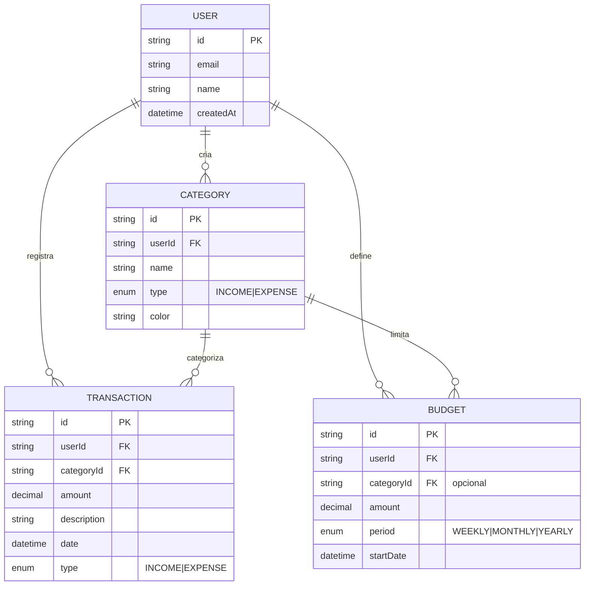

---

## 🔐 Fluxo de Autenticação

Antes de usar qualquer funcionalidade, você precisa se autenticar (fazer login):

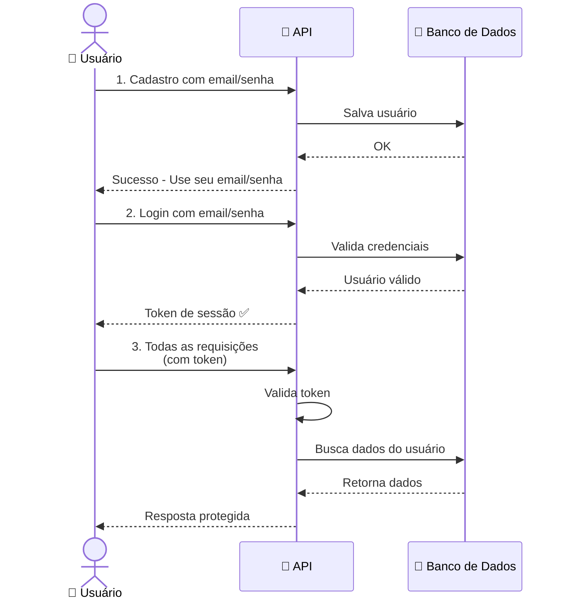

**Importante**: Todo acesso à API (exceto login/cadastro) requer o token de sessão.

---

## 🚀 Jornada Típica de um Usuário

Assim é o fluxo de como você usaria o sistema dia a dia:

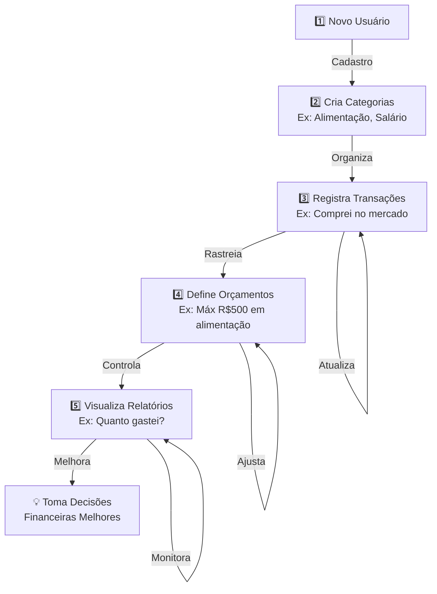

---

## 📚 Os 5 Pilares do Sistema

### 1. 🔑 **Autenticação (Auth)**
**O que faz**: Valida seu login e cria uma sessão segura

| Ação | O que acontece |
|------|---|
| **Cadastro** | Você cria uma conta com email e senha |
| **Login** | Você entra e recebe um token de acesso |
| **Proteção** | Todos os seus dados são privados |

---

### 2. 🏷️ **Categorias**
**O que faz**: Organiza suas receitas e despesas em grupos

**Exemplos de categorias:**
- 💵 **Receitas**: Salário, Freelance, Investimentos
- 💸 **Despesas**: Alimentação, Transporte, Lazer, Moradia

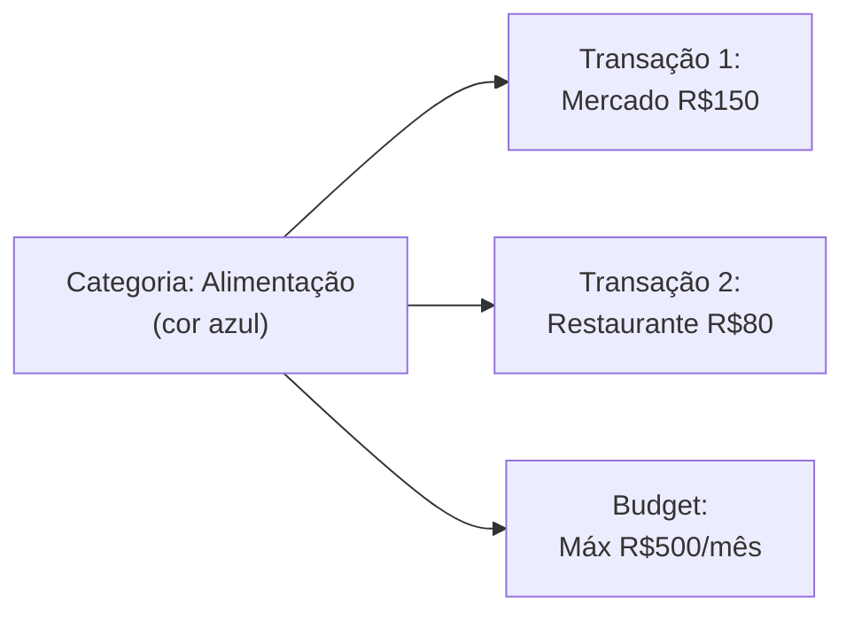

**Operações:**
- ✅ Criar, editar, deletar categorias
- ✅ Cada categoria tem um tipo (receita ou despesa)
- ✅ Você pode colorir para melhor visualização

---

### 3. 💰 **Transações**
**O que faz**: Registra cada movimento de dinheiro (entrada ou saída)

**Exemplo prático:**
```
Data: 15 de outubro
Categoria: Alimentação
Tipo: Despesa
Valor: R$ 150,00
Descrição: Compras no mercado
```

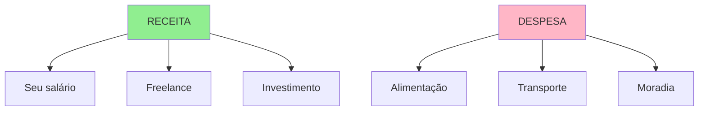

**Operações:**
- ✅ Registrar novas transações
- ✅ Filtrar por data, categoria ou tipo
- ✅ Editar ou deletar transações antigas
- ✅ Visualizar histórico

---

### 4. 💸 **Orçamentos (Budgets)**
**O que faz**: Define limites de gastos para ajudar você a controlar

**Exemplos:**
- "Máximo R$500 em alimentação por mês"
- "Máximo R$200 em lazer por semana"
- "Máximo R$3000 total de despesas por mês"

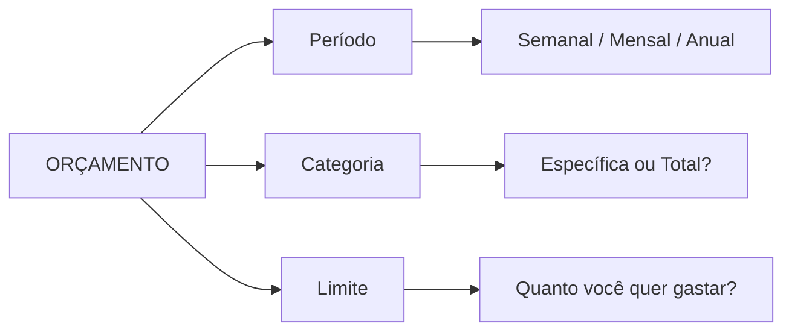

**Tipos:**
- 🎯 **Por categoria**: Limite para uma categoria específica
- 🌍 **Geral**: Limite total de gastos

---

### 5. 📊 **Relatórios (Reports)**
**O que faz**: Analisa seus dados e mostra insights

**4 tipos de relatórios:**

#### a) **Resumo Geral**
```
Período: 1 a 31 de outubro
├─ Total de Receitas: R$ 5.000
├─ Total de Despesas: R$ 2.500
└─ Saldo: R$ 2.500 (positivo ✅)
```

#### b) **Gastos por Categoria**
```
Alimentação:     R$ 800  [████░░░░░] 35%
Transporte:      R$ 400  [██░░░░░░░] 15%
Lazer:           R$ 500  [███░░░░░░] 20%
Moradia:         R$ 800  [████░░░░░] 30%
```

#### c) **Status do Orçamento**
```
Alimentação (Budget: R$500)
├─ Gasto: R$800
└─ Status: ⚠️ EXCEDIDO (160%)

Transporte (Budget: R$300)
├─ Gasto: R$250
└─ Status: ✅ OK (83%)
```

#### d) **Tendências Mensais**
```
Mês        Receitas    Despesas    Saldo
Oct/24     R$5000      R$2500      R$2500  📈
Sep/24     R$5000      R$2300      R$2700  📈
Aug/24     R$4800      R$2600      R$2200  📉
```

---

## 🔀 Fluxo Completo de Dados

Veja como os dados se movem pelo sistema:

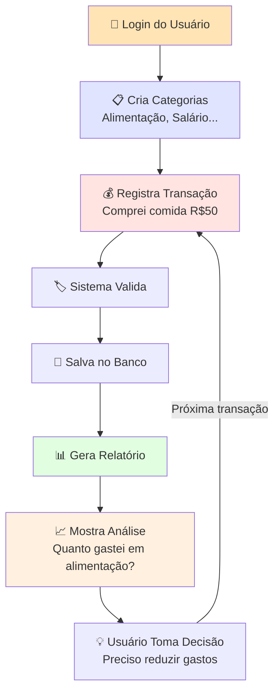

---

## 📱 Exemplo Prático: Seu Primeiro Mês

### Semana 1: Configuração
```
1. Você se cadastra com email e senha ✅
2. Cria suas categorias:
   - Salário (receita)
   - Alimentação (despesa)
   - Transporte (despesa)
   - Lazer (despesa)
3. Define um orçamento:
   - Máximo R$1000 em despesas por semana
```

### Semana 2-4: Uso Diário
```
📅 05/10 - Recebeu salário
   └─ Registra: Receita R$3000 (categoria Salário)

📅 06/10 - Comprou comida
   └─ Registra: Despesa R$150 (categoria Alimentação)

📅 07/10 - Pagou passagem
   └─ Registra: Despesa R$80 (categoria Transporte)

📅 15/10 - Saiu com amigos
   └─ Registra: Despesa R$200 (categoria Lazer)
```

### Fim do Mês: Análise
```
✅ Você acessa os relatórios e vê:
   - Total de receitas: R$3000
   - Total de despesas: R$1200
   - Saldo positivo: R$1800
   - Categoria com maior gasto: Alimentação (45%)
   - Orçamento: Dentro dos limites ✅
```

---

## 🎮 Como Usar Cada Funcionalidade

### 1️⃣ Gerenciar Categorias

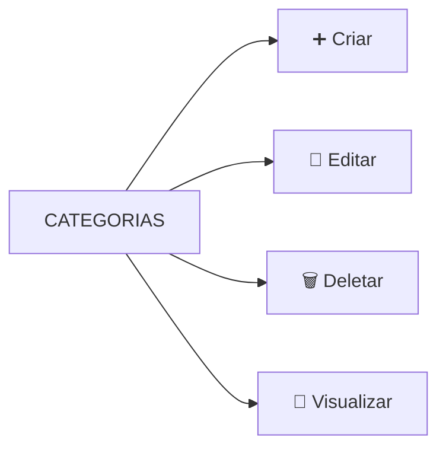

**Passo a passo:**
1. Defina um nome (ex: "Alimentação")
2. Escolha o tipo (receita ou despesa)
3. Opcionalmente, escolha uma cor
4. Salve

---

### 2️⃣ Registrar Transações

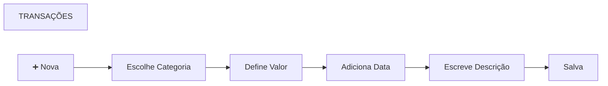

**Informações necessárias:**
- Categoria (ex: Alimentação)
- Valor (ex: R$50,00)
- Data (ex: 05/10/2024)
- Descrição (opcional, ex: "Mercado")

---

### 3️⃣ Definir Orçamentos

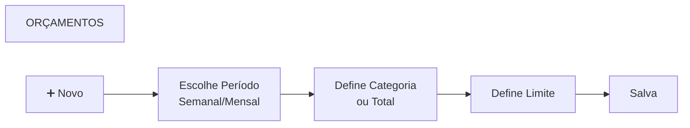

**Exemplo:**
- Período: Mensal
- Categoria: Alimentação
- Limite: R$500

---

### 4️⃣ Visualizar Relatórios

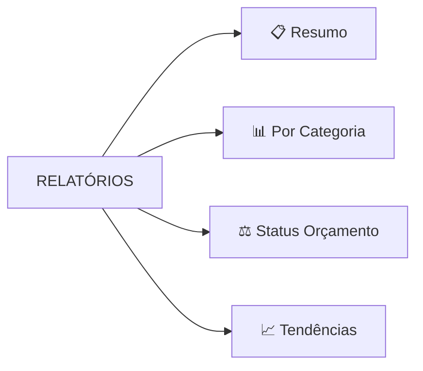

**Você pode:**
- Filtrar por data
- Ver análises automáticas
- Identificar padrões de gasto

---

## 💡 Dicas e Boas Práticas

### ✅ Faça Isso:
1. **Registre transações regularmente** - Quanto mais atual, melhor a análise
2. **Use categorias bem definidas** - Facilita filtrar depois
3. **Defina orçamentos realistas** - Baseado no seu histórico
4. **Revise relatórios mensalmente** - Entenda seus padrões
5. **Use cores nas categorias** - Melhor visualização

### ❌ Evite Isso:
1. **Não deixe transações registrar-se sozinhas** - Sempre confirme valores
2. **Não crie categorias demais** - Máximo 10-15 é ideal
3. **Não ignore alertas de orçamento ultrapassado** - Ajuste gastos
4. **Não confunda tipos** - Receita ≠ Despesa

---

## 🔍 Entendendo os Dados

### Tipos de Transação

| Tipo | Significado | Exemplos |
|------|---|---|
| **INCOME** | Dinheiro ENTRANDO | Salário, Freelance, Venda, Investimento |
| **EXPENSE** | Dinheiro SAINDO | Compras, Contas, Lazer |

### Períodos de Orçamento

| Período | Significa | Útil Para |
|---------|-----------|-----------|
| **WEEKLY** | 7 dias | Controle semanal, gastos diários |
| **MONTHLY** | 30 dias | Maioria dos gastos e planejamento |
| **YEARLY** | 365 dias | Despesas anuais, metas longas |

---

## 📡 Arquitetura do Sistema

Como tudo funciona "por trás das cortinas":

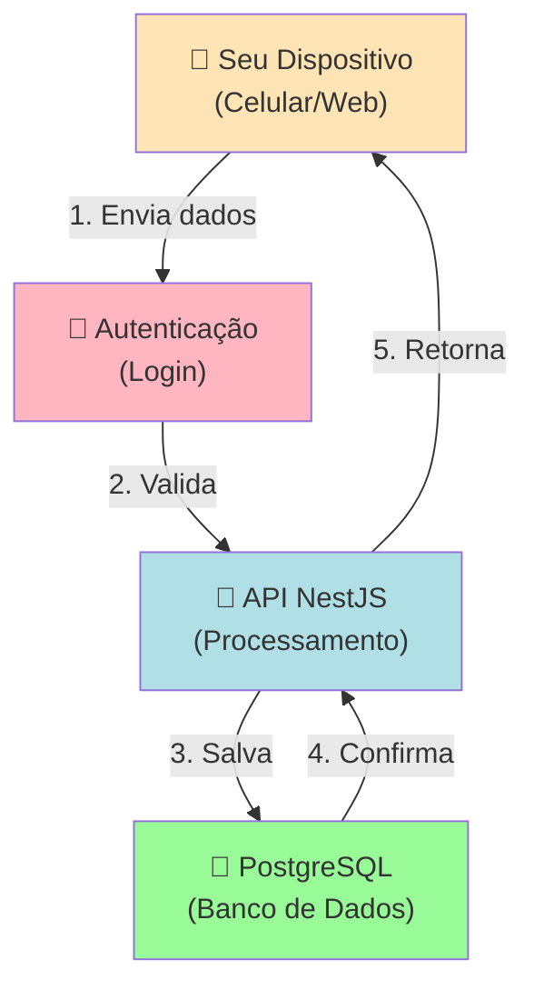

**Componentes:**
- **API**: Recebe suas requisições e processa
- **Banco de Dados**: Armazena todos os seus dados
- **Autenticação**: Garante que apenas você acessa seus dados

---

## 🚨 Perguntas Frequentes

### P: Meus dados são seguros?
**R**: Sim! Cada usuário só vê seus próprios dados. Senhas são protegidas.

### P: Posso usar no celular?
**R**: Sim! O sistema suporta aplicativos mobile via tecnologia Expo.

### P: E se eu deletar uma categoria?
**R**: Suas transações continuam registradas, mas sem categoria. Você pode ver todas as transações antes de deletar.

### P: Como filtrar transações?
**R**: Você pode filtrar por:
- Data (de/até)
- Categoria
- Tipo (receita/despesa)

### P: Os orçamentos são obrigatórios?
**R**: Não! São opcionais. Use apenas se quiser controlar limites.

---

## 📞 Próximos Passos

1. **Faça login** e crie suas categorias
2. **Registre suas transações** dos últimos meses
3. **Defina orçamentos** realistas
4. **Acompanhe os relatórios** mensalmente
5. **Ajuste seus hábitos** baseado nos insights

---

## 📖 Resumo Visual Completo

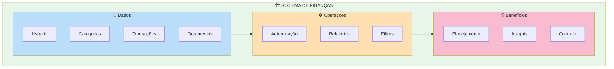

---

**Desenvolvido com ❤️ para ajudar você a dominar suas finanças!**
